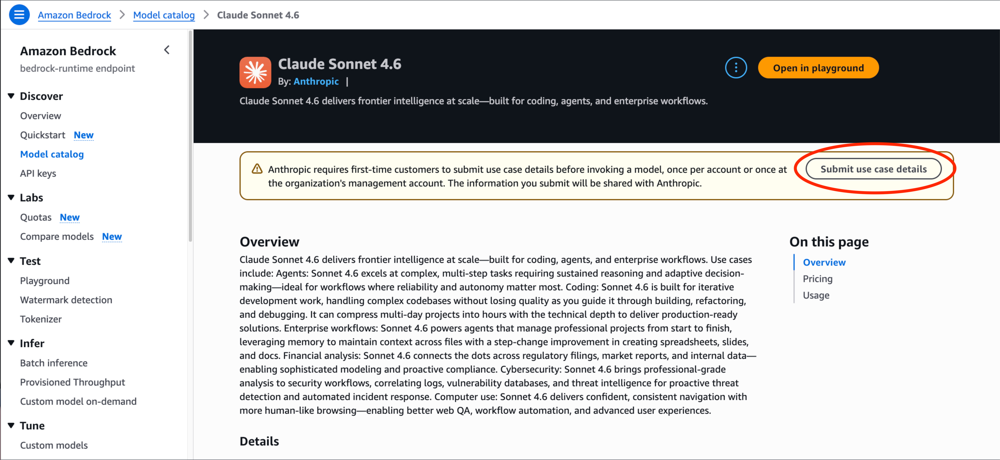
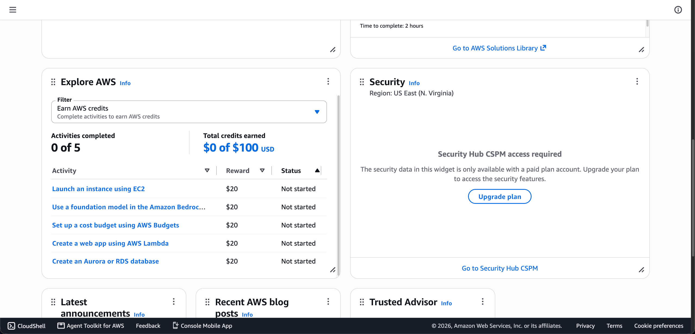

# AWS Account Setup and Amazon Bedrock Access

This guide walks you through creating an AWS account, preparing access to Anthropic Claude models, earning Free Tier credits, and checking your balance. For API authentication and code, follow the assignment's setup instructions after completing this guide.

Console labels and offers may change. Check the terms shown in your own account. You can also watch this [optional registration overview](https://youtu.be/y77Ys4lgp8s); use AWS's current documentation if the video differs from the console.

## 1. Create an AWS account

1. Open the [AWS Free Tier website](https://aws.amazon.com/free/) and choose **Create an AWS Account**.
2. Choose the **Free plan**.
3. Complete the requested contact, identity, and payment-method verification.
4. Finish registration and sign in to the AWS Management Console.

Eligible new customers receive \$100 in credits and can earn up to $100 more through the activities in Section 3. Existing or previous AWS customers are not eligible for the new-customer offer.

The Free plan ends after six months or when its credits are exhausted, whichever comes first. A credit's expiration date is separate from the Free plan's end date. If AWS asks you to upgrade or activate a paid-only service, check with course staff before proceeding: paid usage can exceed your credits. See the [AWS Free Tier FAQ](https://aws.amazon.com/free/free-tier-faqs/) for current eligibility and plan details.

## 2. Submit use case details for Anthropic models, if prompted

The screenshots below illustrate the **bedrock-runtime** console flow. AWS currently exempts Anthropic models accessed through **bedrock-mantle** from this form requirement. Follow the endpoint specified in your assignment.

1. Open the [Amazon Bedrock console](https://console.aws.amazon.com/bedrock/).
2. Select the AWS Region specified in your assignment.
3. In the left navigation pane, under **Discover**, choose **Model catalog**.
4. Filter by **Anthropic** and select any Anthropic model.
5. Choose **Submit use case details**.

6. Complete the form. For this course, the following example may help.

    | Field | Example or guidance |
    | --- | --- |
    | Company name | Johns Hopkins University|
    | Company website URL | https://machine-programming.github.io/ |
    | Industry | Education |
    | Intended users | Internal users|
    | Use case description | I am a student in the Machine Programming course at Johns Hopkins University. I will use Claude models through Amazon Bedrock for course assignments involving code generation, program synthesis, and AI-assisted software development in an academic setting.|

AWS states that access is granted immediately after successful form submission, but the separate first-use subscription process can take up to 15 minutes and requires appropriate permissions and a valid payment method. See [AWS model access documentation](https://docs.aws.amazon.com/bedrock/latest/userguide/model-access.html).

## 3. Earn up to $100 in additional credits

1. Open [AWS Console Home](https://console.aws.amazon.com/console/home), then find the **Explore AWS** widget.
2. Go to **Earn AWS credits** .
3. Choose an activity, select **Start activity**, and follow its instructions. There are five activities worth $20 each.
5. Follow each activity's cleanup instructions and delete resources you no longer need so they do not continue consuming credits.

## 4. Check your available credits

1. Open [Billing and Cost Management](https://console.aws.amazon.com/costmanagement/).
2. In the left navigation pane, under **Billing and Payments**, choose **Credits**.
3. Review the remaining balance and the entries under **Active credits**, including their expiration dates and applicable services.
4. After completing an activity, check for the awarded credit.

## 5. Generate an Amazon Bedrock API key

1. Open the [Amazon Bedrock console](https://console.aws.amazon.com/bedrock/).
2. In the left navigation pane, choose **API keys**.
3. Choose **Generate short-term API key** or **Generate long-term API key**. For a long-term key, set its expiration to shortly after the assignment deadline and configure the permissions required by the assignment.
4. Choose **Generate** and copy your API key. Store it securely and follow the assignment's instructions to configure it. Do not include it in submitted code, repositories, or screenshots.

## 6. Get additional help

Use the search bar at the top of the AWS console to find services and documentation. You can also ask Amazon Q for help with AWS questions or troubleshooting.
